# IncomeVault — Specification and technical choice

[TOC]

## Introduction

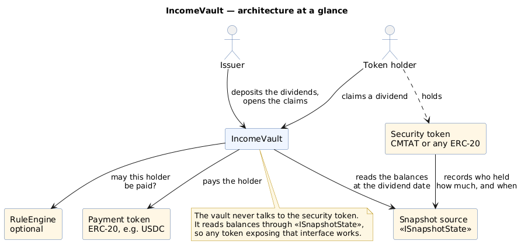

_Diagram source: [doc/schema/plantuml/incomevault-architecture.puml](./schema/plantuml/incomevault-architecture.puml).
This is the overview; the detailed flow of the same process is [further down](#snapshot-source)._

 \0. On the snapshot source (e.g. a `SnapshotEngine` bound to a CMTAT), the admin registers the dividend `time` to perform a snapshot and store the holder’s balance at this specified time.

1. An authorized address perform a deposit in the `IncomeVault` for a specific `time`
2. An authorized address open the claim for this specific `time`
3. Holder claims his dividends by calling the function `claimDividend`

## Snapshot source

The vault never talks to the token directly. It holds a single reference, `snapshotEngine`, typed with
**`ISnapshotSource`** (`src/interfaces/ISnapshotSource.sol`) — the three functions it actually calls,
and nothing else:

| Function | Used by |
| --- | --- |
| `snapshotInfo(uint256 time, address tokenHolder)` | `claimDividend` |
| `snapshotInfoBatch(uint256[] times, address[] addresses)` | `claimDividendBatch` |
| `snapshotInfoBatch(uint256 time, address[] addresses)` | `distributeDividend` |

`ISnapshotSource` is a strict subset of `ISnapshotState`, defined by the
[SnapshotEngine](https://github.com/CMTA/SnapshotEngine), which declares eight functions. The
signatures are copied verbatim, so **every `ISnapshotState` implementation already satisfies it** —
the external `SnapshotEngine`, a token embedding the snapshot modules, or a custom provider — while a
new implementation only has to write the three the vault calls, not five it would never see used.
Solidity has no implicit conversion between unrelated interfaces, so pass one with an explicit cast:
`ISnapshotSource(address(engine))`.

The address is set at initialization (parameter `snapshotEngine_`) and cannot be the zero address.

> The vault does **not** verify the interface through ERC-165. The canonical `SnapshotEngine`
> advertises no id for it, so a guard would reject the implementation the vault is built for. And
> ERC-165 expresses shape, never semantics: a source returning attacker-chosen balances satisfies this
> interface exactly as an honest one does. Trusting the snapshot source stays a configuration
> decision.

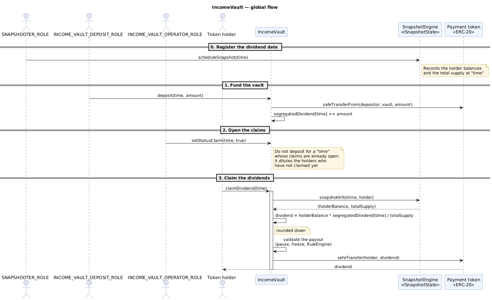

_Diagram source: [doc/schema/plantuml/incomevault-global.puml](./schema/plantuml/incomevault-global.puml)._

## Access control

The vault separates **what** is protected from **who** may do it. The logic contracts declare one
`internal view virtual` authorization hook per capability, invoked by a modifier; each deployment
contract overrides the hooks with the policy it wants. Because the hooks are declared without a
body, the compiler refuses to deploy a vault that has not answered the question.

```solidity
// IncomeVaultRestricted — declares the capability
modifier onlyWithdrawManager() { _authorizeWithdraw(); _; }
function withdraw(...) public virtual onlyWithdrawManager { ... }
function _authorizeWithdraw() internal view virtual;

// IncomeVault — declares the policy
function _authorizeWithdraw() internal view virtual override onlyRole(INCOME_VAULT_WITHDRAW_ROLE) {}
```

### Deployment variants

Two deployments ship. **The choice is made at deployment and cannot be changed afterwards** — they
are different contracts, not a setting, and a deployed proxy cannot be swapped from one to the other.

| Contract | Access control | `initialize` first argument |
| --- | --- | --- |
| `IncomeVault` | Role-based, CMTAT `AccessControlModule` (`AccessControlUpgradeable`) | `address admin` |
| `IncomeVaultOwnable2Step` | Single owner, ERC-173 `Ownable2StepUpgradeable` | `address owner_` |

### Capability table

| Capability | Function(s) | Hook | `IncomeVault` | `IncomeVaultOwnable2Step` |
| --- | --- | --- | --- | --- |
| Fund the vault | `deposit` | `_authorizeDeposit` | `INCOME_VAULT_DEPOSIT_ROLE` | owner |
| Remove funds | `withdraw`, `withdrawAll` | `_authorizeWithdraw` | `INCOME_VAULT_WITHDRAW_ROLE` | owner |
| Push payouts | `distributeDividend` | `_authorizeDistribute` | `INCOME_VAULT_DISTRIBUTE_ROLE` | owner |
| Claim window | `setStatusClaim`, `setTimeLimitToWithdraw` | `_authorizeOperator` | `INCOME_VAULT_OPERATOR_ROLE` | owner |
| Compliance engine | `setRuleEngine` | `_authorizeRuleEngineManagement` | `DEFAULT_ADMIN_ROLE` | owner |
| Emergency stop | `pause`, `unpause` | `_authorizePause` | `PAUSER_ROLE` | owner |
| Permanent kill | `deactivateContract` | `_authorizeDeactivate` | `DEFAULT_ADMIN_ROLE` | owner |
| Address freeze | `setAddressFrozen`, `batchSetAddressFrozen` | `_authorizeFreeze` | `ENFORCER_ROLE` | owner |

Role management itself (`grantRole` / `revokeRole`) is held by `DEFAULT_ADMIN_ROLE` in the
role-based variant; in the single-owner variant, ownership moves through the two-step
`transferOwnership` / `acceptOwnership` handover.

> **`IncomeVaultOwnable2Step` cannot express separated duties.** Every capability collapses to the
> single owner, so the account that funds the vault is also the account that can empty it through
> `withdrawAll`. Pick it only when one key legitimately holds everything; an issuer paying dividends
> normally wants `IncomeVault`, where depositing and withdrawing are distinct privileges.

> **The role-based admin is not constrained by role separation.** The CMTAT `AccessControlModule`
> treats `DEFAULT_ADMIN_ROLE` as implicitly holding every role, so the admin passes every check —
> but it does **not** appear in `getRoleMember` enumerations, so an off-chain tool listing role
> holders will not show it. Role separation constrains the operators, never the admin.

> **`PAUSER_ROLE` and `ENFORCER_ROLE` are published by both variants** because they are declared by
> the CMTAT `PauseModule` and `EnforcementModule` the vault inherits. In `IncomeVaultOwnable2Step`
> they are never checked; granting them is impossible there and reading them means nothing. The
> vault's own four roles are declared in `IncomeVaultRolesStorage`, inherited only by `IncomeVault`,
> so they are not published by the variant that does not enforce them.

## Segregated Deposit

Each deposit is segregated in its time value. A `time` is the dividends distribution date (Unix Timestamp) to the token holders. 

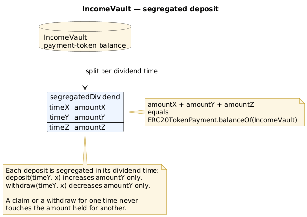

_Diagram source: [doc/schema/plantuml/incomevault-segregated-deposit.puml](./schema/plantuml/incomevault-segregated-deposit.puml)._

## ValidationModule

A claim is considered as a transfer from the contract to the sender (token holder).
This transfer can be restricted with the `IncomeVaultValidationModule`, which composes three CMTAT
modules and an optional RuleEngine:

- `EnforcementModule` — freeze/unfreeze an address (`ENFORCER_ROLE`)
- `PauseModule` — put the contract in the pause state (`PAUSER_ROLE`), or deactivate it
- an optional `IRuleEngine` for additional rules

If any of them refuses the transfer, the function reverts with
`IncomeVault_InvalidTransfer(from, to, value)`.

The public view `canTransfer(from, to, value)` returns the same answer without reverting, and
`detectTransferRestriction` / `messageForTransferRestriction` forward the ERC-1404 introspection to
the RuleEngine.

### Freezing the vault itself

`canTransfer` is always called with the vault as `from`, and `setAddressFrozen` accepts any address —
so `ENFORCER_ROLE` can freeze **the vault**, which stops every payout: both `claimDividend` and
`distributeDividend` revert. It is a second kill-switch alongside `pause`, reachable without holding
`PAUSER_ROLE`.

Know its limits before reaching for it:

- **It is not visible through `paused()`**, which stays `false`. A monitor watching the pause flag sees
  a healthy vault.
- **The revert is the ordinary `IncomeVault_InvalidTransfer`**, the same error a blocked holder gets.
  Distinguish the two by checking the `AddressFrozen` logs for the vault's own address.
- **It does not protect the funds.** Deposits still succeed, and `INCOME_VAULT_WITHDRAW_ROLE` can still
  drain the contract with `withdrawAll`. It stops holders being paid; it is not a safe mode.

Use `pause` for an emergency stop. Freezing the vault is the compliance-officer lever, and the pause
state is the one an operator should monitor.

### RuleEngine 

As for the CMTAT, there is the possibility to configure a ruleEngine with rules to perform transfer rectriction/verification. As relevant rules, we have:

- Whitelist 
- Blacklist 
- Sanctionlist 
- ConditionalTransfer

The vault is **not** a token bound to the RuleEngine. It only uses the *view* entry point
`IRuleEngine.canTransfer(from, to, value)`:

- `transferred(...)` is restricted to bound tokens by the RuleEngine and would revert here;
- a dividend payout is a movement of the *payment* token, not of the security token, so it must not
  update the stateful rules of the engine.

The RuleEngine can be changed at any time with `setRuleEngine` (`DEFAULT_ADMIN_ROLE`), and set to
the zero address to disable the rule checks.


## Operation

### Claim dividends

The distribution of dividends is not automatic. A token holder has to claim his dividends by calling the function `claimDividend`, similar to the Lido protocol. When he claims his dividends, he precises the defined `time`.

Therefore, a token holder has to know the different `time` when a deposit has been performed.

 

A function `claimDividend` in batch is also available to claim dividends for several different time.

### Claim restriction

An holder can not claim its dividends if:

a. The claim time is in the future (`IncomeVault_TooEarlyToWithdraw`)

b. The claim time is too far in the past, specified by `timeLimitToWithdraw` (`IncomeVault_TooLateToWithdraw`)

c. Claim is not enabled for this specific `time` (`IncomeVault_ClaimNotActivated`)

d. Holder has already claim its dividends (`IncomeVault_DividendAlreadyClaimed`)

e. There is no dividend to claim (`IncomeVault_NoDividendToClaim`)

For the batch function, `claimDividendBatch`, `d` and `e` don't generate an error but instead, there is just no dividends distributed for this specific time.

### Schema

This schema describes the different smart contracts called when a token holder claims his dividends.

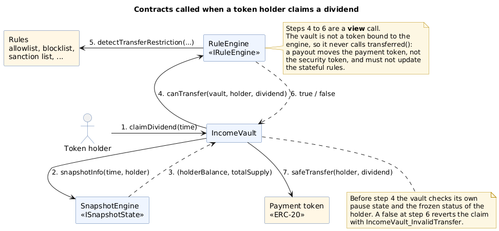

_Diagram source: [doc/schema/plantuml/incomevault-ruleengine.puml](./schema/plantuml/incomevault-ruleengine.puml)._

#### Formula

The computation of dividends is performing according to the following formula

```
senderDividend = (senderCMTATBalance * dividendTotalSupply) / TokenTotalSupply;
```

The sender dividend will be rounded to the inferior integer.  Thus, the issuer should put a “limit” date to claim his dividend in order to withdraw the staying funds (due to rounding) from the smart contract.

Example with USDC (6 decimal) and a CMTAT (0 decimal)

tokenSupply CMTAT = 12’351

The sender has 4221 tokens.

21’555.50 $ in USDC are deposited corresponding to a value of 21555500000 tokens since USDC has 6 decimals.

 We have: 

senderDividend = 4221 * 21555500000 /  12351 = 7366671969.880981297 = 7366671969 which correspond to **7366.671969**$

#### Schema

Schema without the `ValidationModule` (see next paragraph)

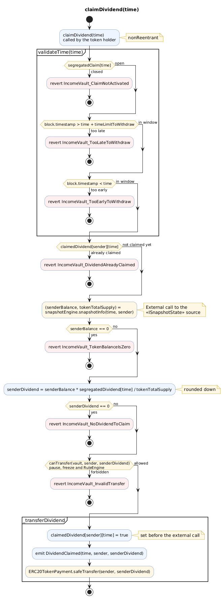

_Diagram source: [doc/schema/plantuml/incomevault-claimdividend.puml](./schema/plantuml/incomevault-claimdividend.puml)._


## Withdraw funds

An authorized user can call the following functions to withdraw funds from the vault:

```
1. withdraw(uint256 time, uint256 amount, address withdrawAddress) public onlyRole(INCOME_VAULT_WITHDRAW_ROLE)
```

and

```
2. withdrawAll(uint256 amount, address withdrawAddress) public onlyRole(INCOME_VAULT_WITHDRAW_ROLE)
```

With the function 1, the funds are withdrawn only from the specific time.

The second function allows to withdraw funds without a specific time, which can lead to an “unstable” state with the different pool of dividend. To be used only in case of emergency or if the vault is closed.

 

## Distribute dividend

An authorized user can also decide to distribute the dividend for a given time and a given list of addresses.

In this situation, the token holder can not decide if he wants to receive his dividends (he is forced to accept) and can not choose the address where he wants to receive his dividends.


Since the function is restricted by access control (`INCOME_VAULT_DISTRIBUTE_ROLE`), it is not possible to use Chainlink Automation to perform an automatic call and distribute the dividends.
Moreover, the list of token holders has to be provided by the transaction’s sender.

`distributeDividend` is subject to the **same claim window** as a holder-driven claim: the claims must
be open for that `time`, `time` must have passed, and the withdraw limit must not have expired. Without
the "too early" bound the distribution would read the *live* balances — `ISnapshotState` falls back to
them when no snapshot has been recorded yet — and would consume each holder's claim for that period at
the wrong amount.

It also goes through the **ValidationModule**, exactly like a claim: the vault must not be paused,
neither the vault nor the holder may be frozen, and the RuleEngine must allow the payout. A holder the
RuleEngine refuses cannot be paid by the issuer either.

One blocked holder **reverts the whole distribution** rather than being skipped, so a compliance
failure can never be silently dropped from a payout the operator believes succeeded. The revert carries
`IncomeVault_InvalidTransfer(from, to, value)`, which names the offending address: remove it from the
list and retry.

## Improvement

- An automatic distribution of dividend could be performed through [Chainlink Automation](https://docs.chain.link/chainlink-automation) but it requires several changes to allow that.
- Only ERC20 tokens are supported. We could extends this to support direct native (e.g ether) too.

## Deployment

The contract has to be deployed with a transparent proxy and the contract is compatible with the standard [ERC-2771](https://eips.ethereum.org/EIPS/eip-2771) for meta transactions.

```
initialize(
    address admin,
    IERC20 ERC20TokenPayment_,
    ISnapshotState snapshotEngine_,
    IRuleEngine ruleEngine_,
    uint256 timeLimitToWithdraw_
)
```

 

## Threat model & FAQ

### Claim dividend several times

> What if a holder tries to claim the same dividend several times?

When a holder claims his dividends for a specific time, a boolean is set to true to indicate the claiming dividend.

```
 claimedDividend[tokenHolder][time] = true;
```

This boolean is set inside the internal function `_transferDividend`

Moreover, the functions to claim are protected against reentrancy attacks with the modifier `nonReentrant` from OpenZeppelin.

### New dividend after claim

> What happens if the authorized address deposit dividend after that a token holder has already claimed his dividends ?

A token holder can not claim his dividends if the claim status is not opened. Moreover, you can not deposit new dividends if the status is on open (=true).

The function `setStatusClaim` allows to open (true) or close(false) the claims for a specific time.

If you close the claim (claim status = false) and deposit new dividends, the previous token holders will be penalized since the dividends total supply for this specific time has improved for all token holders which have not already claimed their dividends,

In summary, when you have opened the claim, you should not deposit new dividends in the vault for a specific time.

### Transfer fails

> What happens if the token transfer fails?

In this case, the whole transaction is reverted, and the smart contract still considers that dividends have not been claimed by the token holder (sender).

## Technical choice

### Functionality

#### Upgradeable

The `IncomeVault` is upgradeable and can be deployed with a Transparent Proxy.

#### Version

Every deployment exposes its release version through the ERC-3643 `version()` view, the same way the
CMTAT, the RuleEngine and the SnapshotEngine do:

```solidity
IERC3643Version(address(vault)).version()   // "1.1.0"
```

The value is the compile-time constant `VERSION` in `src/modules/VersionModule.sol`. Bump it together
with the `CHANGELOG.md` heading of the release — the changelog checklist lists it as the first task.

#### Storage (ERC-7201)

The state of the vault is held in a single [ERC-7201](https://eips.ethereum.org/EIPS/eip-7201)
namespaced storage struct, the pattern used by OpenZeppelin Upgradeable and by the CMTAT:

```solidity
// keccak256(abi.encode(uint256(keccak256("IncomeVault.storage.IncomeVaultInternal")) - 1)) & ~bytes32(uint256(0xff))
bytes32 private constant IncomeVaultInternalStorageLocation = 0xe4f8b033bcfc537db031b0e68e3c1ab0f1de86cf03893d031b6590510b0c0c00;

/// @custom:storage-location erc7201:IncomeVault.storage.IncomeVaultInternal
struct IncomeVaultInternalStorage {
    ISnapshotState _snapshotEngine;
    IERC20 _ERC20TokenPayment;
    mapping(address tokenHolder => mapping(uint256 time => bool claimed)) _claimedDividend;
    mapping(uint256 time => uint256 dividend) _segregatedDividend;
    mapping(uint256 time => bool status) _segregatedClaim;
    uint256 _timeLimitToWithdraw;
}
```

Because the namespace is derived from a hash, it cannot collide with the storage of the inherited
CMTAT and OpenZeppelin modules, which use their own namespaces. Consequences:

- there is **no** `uint256[50] private __gap` anywhere, and the contract declares no sequential
  storage slot at all;
- a new field can simply be appended to the struct in a later version;
- the fields are read through the public getters `snapshotEngine()`, `ERC20TokenPayment()`,
  `claimedDividend()`, `segregatedDividend()`, `segregatedClaim()` and `timeLimitToWithdraw()`,
  so the external interface is the same as if they were public state variables.

The hardcoded slot is re-derived from the namespace and compared against what the proxy really
stores in `test/IncomeVaultStorage.t.sol`.

#### Urgency mechanism

Through the `PauseModule`, the contract can be put in pause (`PAUSER_ROLE`), forbidding all claims.
A paused contract can also be permanently deactivated with `deactivateContract`
(`DEFAULT_ADMIN_ROLE`).

#### Token agnostic

The vault reads the holder balances and the total supply through the `ISnapshotState` interface of
the [SnapshotEngine](https://github.com/CMTA/SnapshotEngine), so it works with any contract
implementing it and not only with the CMTAT. See [Snapshot source](#snapshot-source).

#### Reentrancy

`claimDividend` and `claimDividendBatch` are protected with `ReentrancyGuardTransient`
(EIP-1153 transient storage). `ReentrancyGuardUpgradeable` was removed from OpenZeppelin Contracts
Upgradeable v5.7.0; the transient variant is storage-free and therefore proxy safe.


#### Gasless support

> The gasless integration was not part of the audit performed by ABDK on the version [1.0.1](https://github.com/CMTA/RuleEngine/releases/tag/1.0.1)

The `IncomeVault` contract supports client-side gasless transactions using the [Gas Station Network](https://docs.opengsn.org/#the-problem) (GSN) pattern, the main open standard for transfering fee payment to another account than that of the transaction issuer. The contract uses the CMTAT `ERC2771Module`, a thin wrapper around the OpenZeppelin contract `ERC2771ContextUpgradeable`, which allows a contract to get the original client with `_msgSender()` instead of the fee payer given by `msg.sender` .

At deployment, the parameter  `forwarder` inside the contract constructor has to be set  with the defined address of the forwarder. Please note that the forwarder can not be changed after deployment.

Please see the OpenGSN [documentation](https://docs.opengsn.org/contracts/#receiving-a-relayed-call) for more details on what is done to support GSN in the contract.

### Schema

> The diagrams below are generated from the sources. Regenerate them with `npm run uml` (UML class
> diagram) and the three scripts in [doc/script](./script) — they rebuild the full per-contract set
> under [doc/surya](./surya): call graphs, inheritance graphs and markdown reports.

#### UML

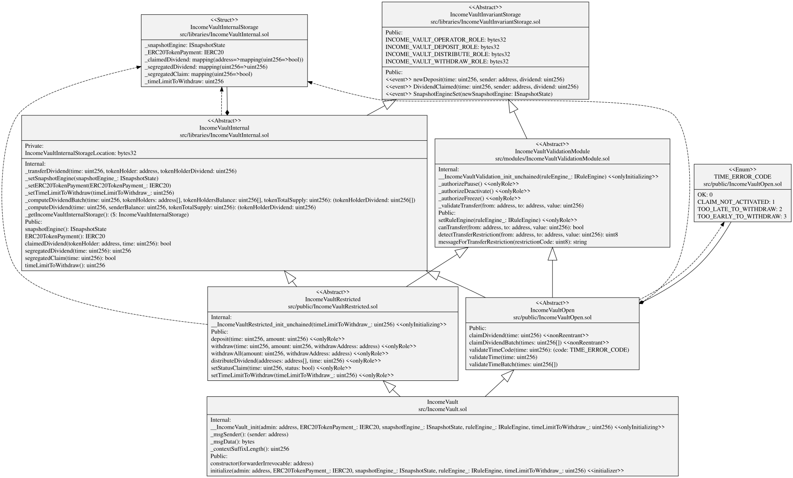

### Inheritance

#### IncomeVault

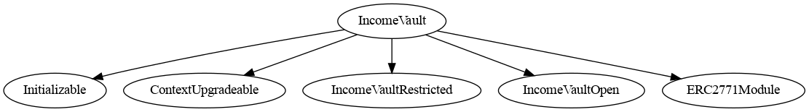

#### IncomeVaultValidationModule

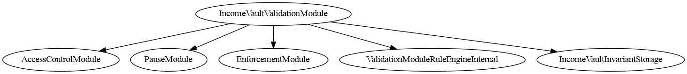

### Graph

#### IncomeVault

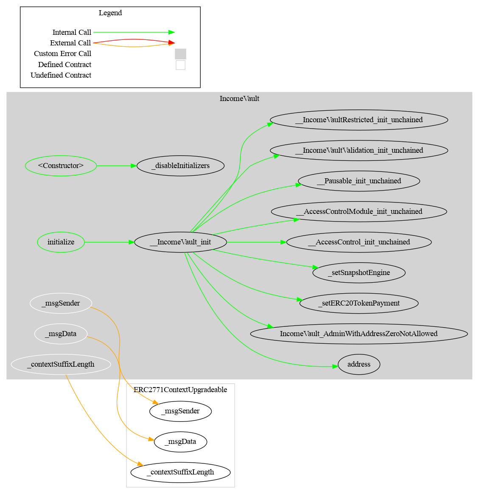

#### IncomeVaultOpen

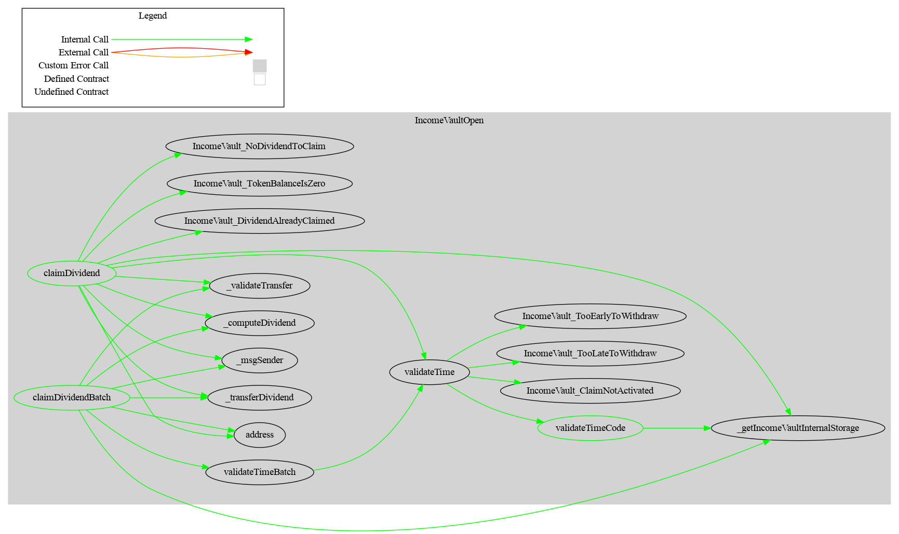

#### IncomeVaultRestricted

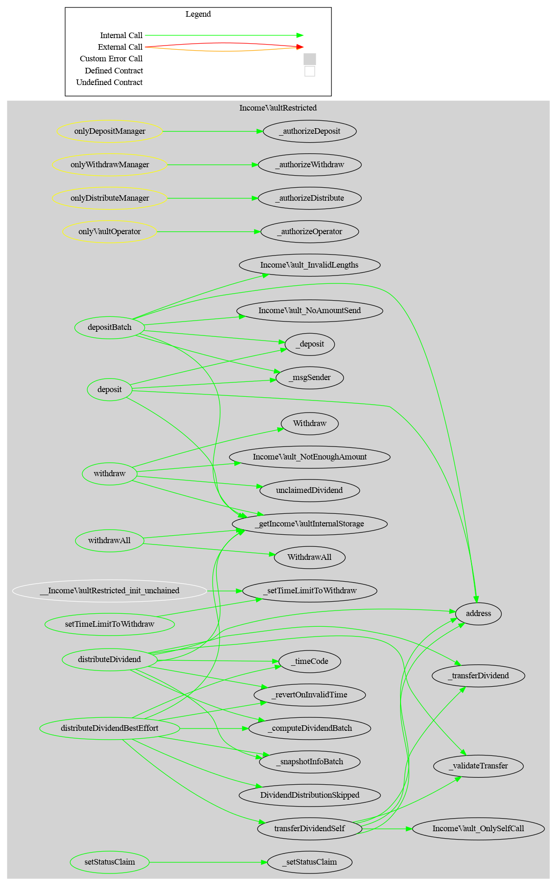

#### IncomeVaultValidationModule

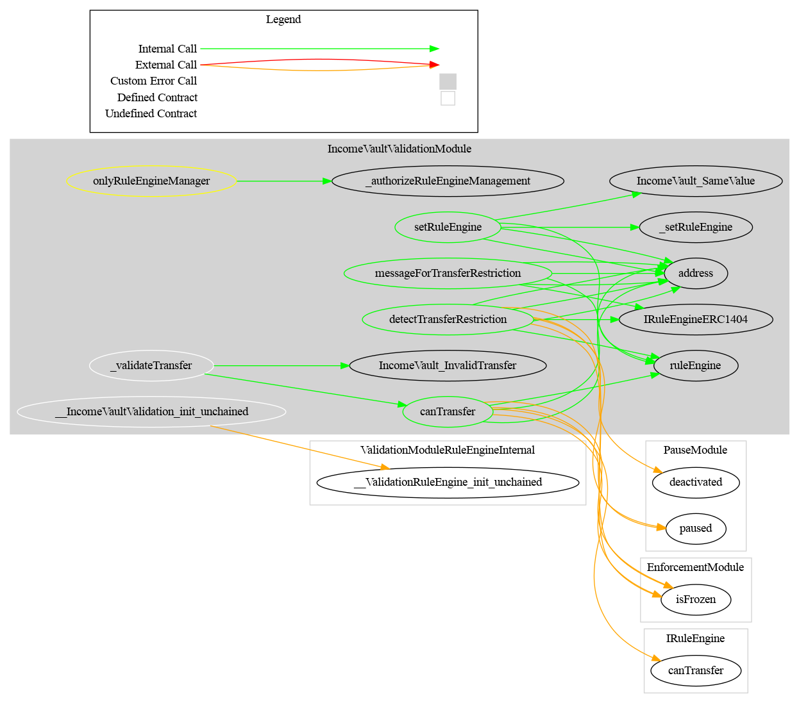

### Report

A markdown report per contract (functions, visibility, modifiers) is available in
[doc/surya/surya_report](./surya/surya_report).
