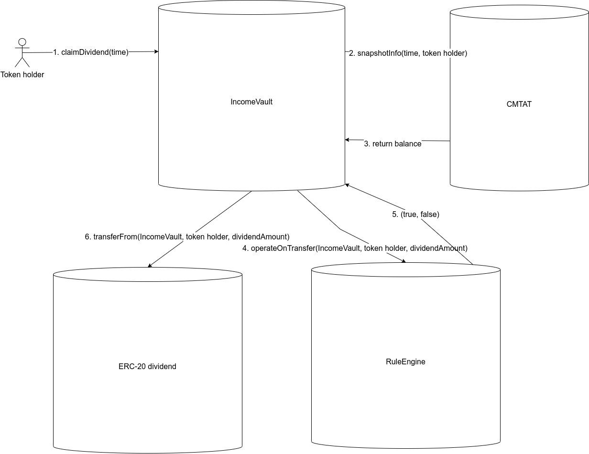

# Specification

[TOC]

## Introduction

 \0. On the CMTAT, the admin registers the dividend `time` to perform a snapshot and store  the holder’s balance at this specified time.

1. An authorized address perform a deposit in the `IncomeVault` for a specific `time`
2. An authorized address open the claim for this specific `time`
3. Holder claims his dividends by calling the function `claimDividend`


## Segregated Deposit

Each deposit is segregated in its time value. A `time` is the dividends distribution date (Unix Timestamp) to the token holders. 


### ValidationModule

A claim is considered as a transfer from the contract to the sender (token holder).
This transfer can be restricted with the ValidationModule

This module is imported from the CMTAT which allows to : 

- Freeze/unfreeze an address
- Put the contract in the pause state
- Call the ruleEngine for additional rules

If the ValidationModule refuses the transfer, the function is reverted.


### RuleEngine 

As for the CMTAT, there is the possibility to configure a ruleEngine with rules to perform transfer rectriction/verification. As relevant rules, we have:

- Whitelist 
- Blacklist 
- Sanctionlist 
- ConditionalTransfer


## Operation

### Claim dividends

The distribution of dividends is not automatic. A token holder has to claim his dividends by calling the function `claimDividend`, similar to the Lido protocol. When he claims his dividends, he precises the defined `time`.

Therefore, a token holder has to know the different `time` when a deposit has been performed.

 

A function `claimDividend` in batch is also available to claim dividends for several different time.

### Schema

This schema describes the different smart contracts called when a token holder claims his dividends.



#### Formula

The computation of dividends is performing according to the following formula

```
senderDividend = (senderCMTATBalance * dividendTotalSupply) / TokenTotalSupply;
```

The sender dividend will be rounded to the inferior integer.  Thus, the issuer should put a “limit” date to claim his dividend in order to withdraw the staying funds (due to rounding) from the smart contract.

Example with USDC (6 decimal) and a CMTAT (0 decimal)

tokenSupply CMTAT = 12’351

The sender has 4221 tokens.

21’555.50 $ in USDC are deposited corresponding to a value of 21555500000 tokens since USDC has 6 decimals.

 We have: 

senderDividend = 4221 * 21555500000 /  12351 = 7366671969.880981297 = 7366671969 which correspond to **7366.671969**$

#### Schema

Schema without the `ValidationModule` (see next paragraph)


## Withdraw funds

An authorized user can call the following functions to withdraw funds from the vault:

```
1. withdraw(uint256 time, uint256 amount, address withdrawAddress) public onlyRole(DEBT_VAULT_WITHDRAW_ROLE)
```

and

```
2. withdrawAll(uint256 amount, address withdrawAddress) public onlyRole(DEBT_VAULT_WITHDRAW_ROLE)
```

With the function 1, the funds are withdrawn only from the specific time.

The second function allows to withdraw funds without a specific time, which can lead to an “unstable” state with the different pool of dividend. To be used only in case of emergency or if the vault is closed.

 

## Distribute dividend

An authorized user can also decide to distribute the dividend for a given time and a given list of addresses.

In this situation, the token holder can not decide if he wants to receive his dividends (he is forced to accept) and can not choose the address where he wants to receive his dividends.


Since the function is restricted by access control, it is not possible to use Chainlink Automation to perform an automatic call and distribute the dividends.
Moreover, the list of token holders has to be provided by the transaction’s sender.

## Improvement

- An automatic distribution of dividend could be performed through [Chainlink Automation](https://docs.chain.link/chainlink-automation) but it requires several changes to allow that.
- Only ERC20 tokens are supported. We could extends this to support direct native (e.g ether) too.

## Deployment

The contract has to be deployed with a transparent proxy and the contract is compatible with the standard [ERC-2771](https://eips.ethereum.org/EIPS/eip-2771) for meta transactions.

 

## Threat model & FAQ

### Claim dividend several times

> What if a holder tries to claim the same dividend several times?

When a holder claims his dividends for a specific time, a boolean is set to true to indicate the claiming dividend.

```
 claimedDividend[tokenHolder][time] = true;
```

This boolean is set inside the internal function `_transferDividend`

Moreover, the functions to claim are protected against reentrancy attacks with the modifier `nonReentrant` from OpenZeppelin.

### New dividend after claim

> What happens if the authorized address deposit dividend after that a token holder has already claimed his dividends ?

A token holder can not claim his dividends if the claim status is not opened. Moreover, you can not deposit new dividends if the status is on open (=true).

The function `setStatusClaim` allows to open (true) or close(false) the claims for a specific time.

If you close the claim (claim status = false) and deposit new dividends, the previous token holders will be penalized since the dividends total supply for this specific time has improved for all token holders which have not already claimed their dividends,

In summary, when you have opened the claim, you should not deposit new dividends in the vault for a specific time.

### Transfer fails

> What happens if the token transfer fails?

In this case, the whole transaction is reverted, and the smart contract still considers that dividends have not been claimed by the token holder (sender).
